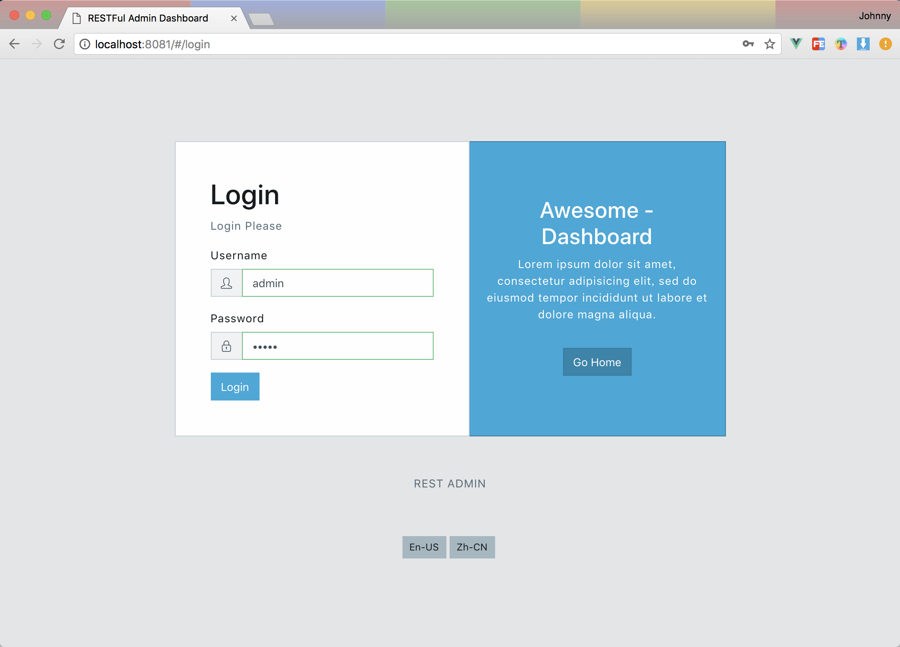
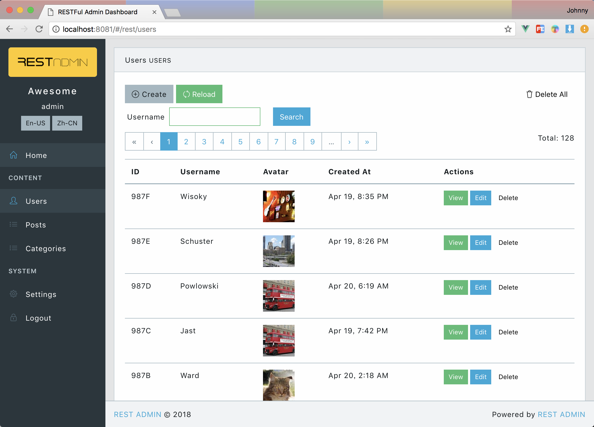
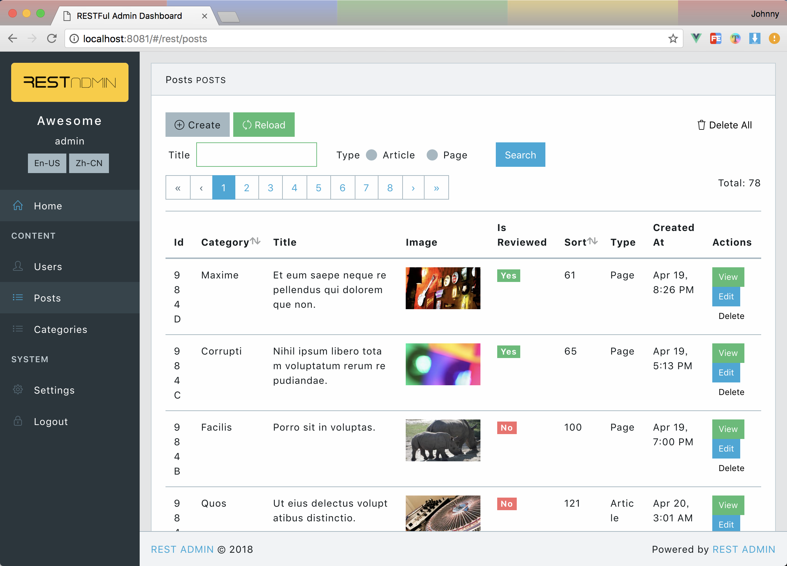
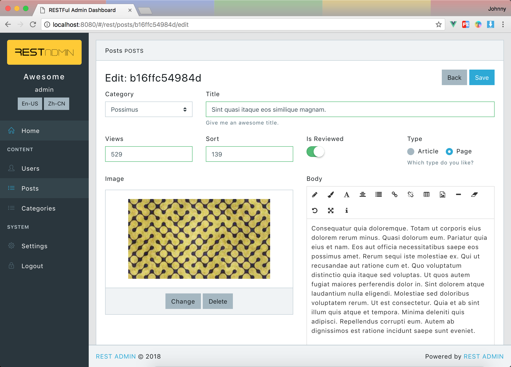

# REST-ADMIN

> An Powerful Admin Dashboard based on Vue.js and Boostrap v4.

REST-ADMIN is trying to make it easier to built an admin dashboard for any backend services. All you need to do is just provide a RESTful api for it.

## Screenshots
| - | - |
|--|--|
| Login Page| Data Table for users|
| Data Table for posts| Data Form for post|
| Custom Form| Sample Fields of posts|

## Features
- Based on the latest Bootstrap(v4) and Vue.js, it means you can easily change any skin based on bootstrap css framework.
- Plain vue.js project, can be used for any backend restful api.
- Powerful **Data Table** with sorting, pagination, searching, display images...
- Powerful **Data Form Builder** can display/edit any value of text, image, boolean...
- Fully support for Resource-based CRUD option.
- English based fully i18n support.
- **Highly Configurable** site info. Such as: site name, logo, **Menu** and footer...
- Production ready. It has been used in two projects in our company.

## Quick Start
```bash
git clone git@github.com:wxs77577/rest-admin.git
cd rest-admin
code . # open with vscode [optional]
npm i # or cnpm i

# start with local test api server
npm run test-api # start test api server
npm run local # start rest admin client
```

> or you have an exists rest api endpot.
```bash
API_URI=http://localhost:5555/admin/api/ npm run dev
```

> The default username and password of test-api is `admin` and `admin`

### Build
```bash
API_URI=http://localhost:5555/admin/api/ npm run build
```
Then just copy `/dist/admin` folder to the anywhere.

> There is a built-in restful api based on `express` for test.


## Fields Definition
> Used in listing tables and editing forms

Example:
```json
{
  "_id": { "label": "ID" },
  "title": { "label": "Title" },
  "type": { "label": "Type", "type": "select", "options": [
    { "text": "Vue", "value": "vue" },
    { "text": "React", "value": "react" },
    { "text": "Angular", "value": "angular" },
  ]},
  "body": { "type": "html" },
  "steps": { "type": "array", "fields": {
    "name": { "label": "Name" },
    "date": { "label": "date" }
  }},
  
  "_actions": { // define table view, it's optional.
    "buttons": { // define buttons as `false` to hide in actions colum
      "delete": false,
      "edit": false
    },
    "toolbar": { // define actions in top toolbar table view
      "extra": [ // add extra buttons
        { "to": "/form?uri=vouchers/generate", "label": "Generate Vouchers" } //properties of `<b-button>`
      ]
    }
  }
}
```
### Field properties
- `label` Title for display
- `cols` column width, total is 12.
- `input_cols` column width of input control.
- `type` Field type, accepted values and additional properties for some fields.
  - `select` raw html `<select>` tag from [b-select](https://bootstrap-vue.js.org/docs/components/form-select) of `bootstrap-vue`
    - `options` e.g. `[{ "text": "Label", "value": "1" }]`
  - `select2` [vue-select](https://github.com/sagalbot/vue-select), like `select2` in jQuery
    - `options` e.g. `[{ "text": "Label", "value": "1" }]`
  - `date` [vue2-datepicker](https://github.com/mengxiong10/vue2-datepicker) support **date range**
  - `switch` A iOS-liked switch component 
  - `html` An WYSIWYG html editor from [vue-html5-editor](https://github.com/PeakTai/vue-html5-editor)
  - `array` Array values
    - `fields` child fields defination
    - `is_table` display as a table ?
  - `radiolist`
    - `options` e.g. `[{ "text": "Label", "value": "1" }]`
  - `checkboxlist`
    - `options` e.g. `[{ "text": "Label", "value": "1" }]`
  - `checkbox`
  - `file` File uploader
    - `limit` define file limit options of **size** in byets, e.g. `{ size: 1000000 }`
  - `image` Image file uploader with preview.
    - `limit` define file limit options of **width** **height** and **size** in byets, e.g. `{ "width": 320, "height": 180, size: 1000000 }`
  - `audio` like `image`
    - `limit` define file limit options of **size** in byets, e.g. `{ size: 1000000 }`
  - `video` like `image`
    - `limit` define file limit options of **size** in byets, e.g. `{ size: 1000000 }`
  - `textarea`
  - `number`
  - `text`
- `required`
- Any other properties accepted in https://bootstrap-vue.js.org/docs/components/form-input, please notice that every kind of field component has it's own properties.

## APIs
> Tips: check `/api/index.js` :p

Example Base Api Url: http://localhost:8088/admin/api

#### GET `/site` (url: http://localhost:8088/admin/api/site)
Get config data of site
- Returns
  ```json
  {
    "name": "Site Name",
    "logo": "http://.../logo.png",
    "menu" : [
      {
        "name": "Home",
        "url": "/",
        "icon": "fa fa-home",
        // for home page
      },
      {
        "name": "Content",
        "title": true,
        // display as a delimiter
      },
      {
        "name": "Posts",
        "url": "/rest/posts",
        "icon": "fa fa-list",
        // url format of resource list: /rest/:resourceName      
      },
      {
        "name": "Config",
        "url": "/form?uri=site/settings",
        "icon": "fa fa-cogs",
        // a custom form.
      },
      {
        "name": "Logout",
        "url": "/login",
        "icon": "fa fa-lock",
        // for logout
      },
    ],
  }
  ```

#### POST `/login`
For admin user login
- POST DATA
  ```json
  {
    "username": "admin",
    "password": "admin"
  }
  ````
- Returns
  ```json
  {
    "user": {
      "username": "admin",
      ...
    },
    "token": "1o2u3h4oi2u3h4jkashdflsda"
  }
  ```
  or with validation errors
  > must response `422` http status.
  ```json
  {
    "name":"HttpException",
    "message":[
      { "field":"password", "message":"Incorrect password." }
    ]
  }
  ```

#### GET `/:resource`
Fetch all records of a resource.
`:resource` means any resource name. e.g. `/users`, `/posts`...

- Returns **IMPORTANT**
  ```json
  {
    "total": 80,
    "perPage": 10,
    "page": 1,
    "data": [
      {...},
      {...},
      {...},
    ]
  }
  ```

#### GET `/:resource/grid`
Fetch grid view config of a resource.
`:resource` means any resource name. e.g. `/users/grid`, `/posts/grid`...

- Returns **IMPORTANT**
  ```json
  {
    "searchModel": {},
    "searchFields": {
      render a searching form
      ...see Fields Definition...
    },
    "fields": {
      render a table view
      ...see Fields Definition...
    }
  }
  ```

#### GET `/:resource/form`
Fetch editing form config of a resource.
`:resource` means any resource name. e.g. `/users/form`, `/posts/form`...

- Returns **IMPORTANT**
  ```json
  {
    "model": {},
    "fields": {
      render a editing form
      ...see Fields Definition...
    }
  }
  ```

#### POST `/:resource`
create a resource
- POST DATA
  ```json
  {
    "_id": "12341234",
    "title": "The New Title",
    ...
  }
  ```
- Returns
  ```json
  {
    "_id": "12341234",
    "title": "The New Title",
    ...
  }
  ```

#### PUT `/:resource/:id`
update a resource
- POST DATA (Request Payload)
  ```json
  {
    "_id": "12341234",
    "title": "The New Title",
    ...
  }
  ```
- Returns
  ```json
  {
    "_id": "12341234",
    "title": "The New Title",
    ...
  }
  ```

#### DELETE `/:resource/:id`
delete a resource
- Returns
  ```json
  {
    "success": true
  }
  ```

#### DELETE `/:resource`
delete all
- Returns
  ```json
  {
    "success": true
  }
  ```

#### Custom Form ?
> To render a custom form, you need to define a `menu` item in `/site` api, or add an `extra` button of toolbar in `/:resource/grid`.

There are two apis for a custom form:
1. Get form definition
  - GET `/site/settings`
  - Returns
    ```
    {
      "title": "Form Title",
      "fields": {
        ...see Fields Definition...        
      }
    }
    ```
2. Handle submission
  - POST `/site/settings`
  - Returns
    ```json
    {
      "success": true,
      "message": "Well done!", //[optional] will show after form submited.
      "redirect": "/" //[optional] auto redirect after form submited, default is back to the last page.
    }
    ```

## i18n
> Check [vu-i18n](https://github.com/kazupon/vue-i18n/) for detailed documentation.

REST-ADMIN gives built-in support for `en-US` and `zh-CN`, you can change translation files in `/src/i18n/*.json`.

## Thanks to
- Vue.js and Bootstrap v4 based [bootstrap-vue](https://github.com/bootstrap-vue/bootstrap-vue)
- Nice UI from [Core UI](https://coreui.io/)
- i18n component from [vue-i18n](https://github.com/kazupon/vue-i18n/)
